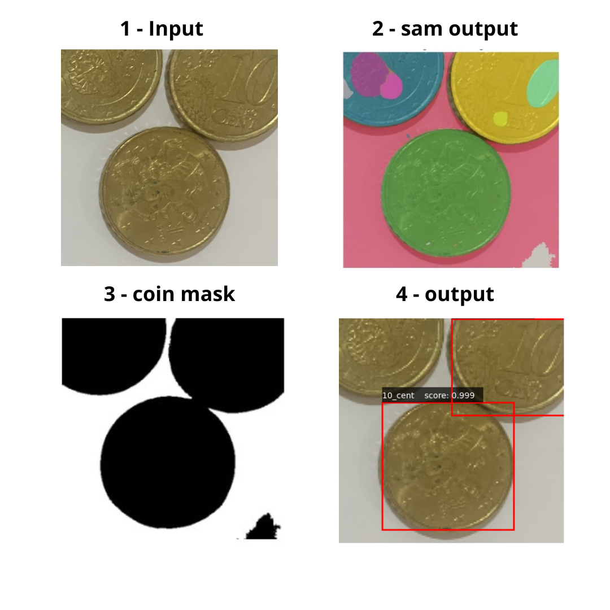

<h1 align="center">
   
  Coin Detection whit FASTERRCNN-RESNET50-FPN
   
</h1>

  

A coin detector using FasterRCNN and the Segment Anything Model 

Machine Learning Project - UniCT, DMI.

******
## Tecnologies

The following two technologies were mainly used for the implementation of the project:
  <ul>
    <li>
      <b> Segment Anything Model (Sam) </b> is a promptable segmentation system with zero-shot generalization to unfamiliar objects and images, without the need for additional training.
      

      
      

    </li>
    <li>
      The <b> Faster R-CNN </b>(Region-based Convolutional Neural Network) is an algorithm for object detection in images. It is one of the most popular and effective convolutional neural networks for the task of object detection.
      Faster R-CNN is known for its accuracy and speed compared to previous approaches such as R-CNN and Fast R-CNN. It introduces the concept of region proposal generation via RPN, which makes the entire object detection process more efficient and accurate.
    </li>
  </ul>
  

  
  

## Papers

The official papers could be found at:
  <ul>
    <li>
      
 <a href="https://arxiv.org/abs/2304.02643"> Segment Anything Model</a>, Alexander Kirillov, Eric Mintun, Nikhila Ravi, Hanzi Mao, Chloe Rolland, Laura Gustafson, Tete Xiao, Spencer Whitehead, Alexander C. Berg, Wan-Yen Lo, Piotr Dollár, Ross Girshick.

    </li>
    <li>
       
 <a href="https://arxiv.org/abs/1506.01497"> R-CNN: Towards Real-Time Object Detection with Region Proposal Networks</a>, Shaoqing Ren, Kaiming He, Ross Girshick, Jian Sun. 

    </li>
  </ul>

## Demo

A demo could be find at the following <a href="https://github.com/Raciti/Coin-Detection_Whit_FASTERRCNN-RESNET50-FPN/blob/main/Demo/Demo.ipynb"> link</a>, test the network with your favourite images.

  
  

## Demo Tutorial

A video tutorial is available at the following <a href="https://drive.google.com/file/d/1uCT_jL5UZSutm-E3IVjafy7u-qrCgOg2/view">link. </a>

## Authors

- [@MarioBenissimo](https://github.com/mariobenissimo)
- [@RosarioCannavò](https://github.com/rosariocannavo)
- [@RiccardoRaciti](https://github.com/Raciti)
